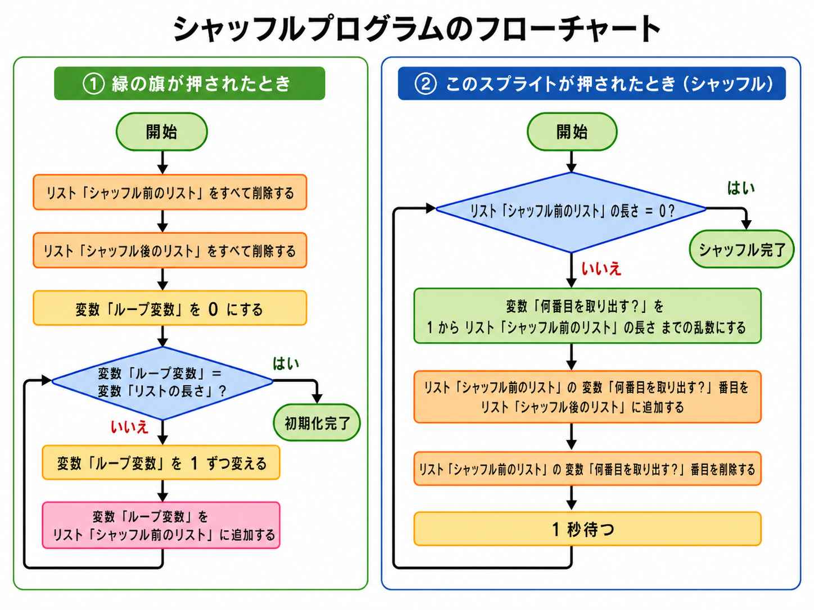

# レッスン11: シャッフル — IDを使ってデータの順番を変えよう

## できるようになること

- [ ] ループ変数を使って、1〜10が順番に入ったリストを作れる
- [ ] フローチャートを見ながら、処理の流れをプログラムにできる
- [ ] リストの「何番目」と、その場所に入っている「値」の違いを説明できる
- [ ] 乱数とリストを組み合わせて、同じものが2回出ないシャッフルを作れる
- [ ] IDを使って、別のリストに入っているデータを取り出せる
- [ ] 自分で対応表を作り、データをランダムな順番で表示できる

## このレッスンで必要な知識

### シャッフルってなに？

トランプを配る前に、カードをまぜるよね。あれが「**シャッフル**」。順番に並んだものを、ランダムな順番にすることだよ。

シャッフルはいろいろなところで使われているよ。

- トランプやカードゲームの山札
- 音楽プレイヤーのシャッフル再生
- ビンゴ大会の抽選機
- ゲームで問題やステージの順番を変えるとき

今日は、フローチャートを読みながら、1〜10の数字が入ったリストをシャッフルするプログラムを作るよ。

### ループ変数ってなに？

くり返しの中で、今何回目なのかを表すために使う変数を、**ループ変数**というよ。

Scratchの「○回くり返す」ブロックには、今何回目なのかを取り出す機能がない。そこで、自分で変数を用意して、くり返すたびに1ずつ増やしていくんだ。

今回は、変数「ループ変数」を使って、1、2、3……と順番に数字を作り、リストへ追加するよ。

### IDってなに？

コンピューターでは、データを見分けるために番号をつけることがある。この番号を**ID**というよ。

たとえば、都道府県に次のようなIDをつけることができる。

| ID | 都道府県 |
|---:|---|
| 1 | 北海道 |
| 2 | 青森県 |
| 3 | 岩手県 |
| 4 | 宮城県 |

IDが分かれば、対応表の同じ番号から都道府県名を取り出せる。

IDの順番をシャッフルすると、都道府県名もランダムな順番で取り出せるんだ。

### リストの「何番目」と「値」

次のリストを見てみよう。

`3, 7, 1, 5`

このリストの、

- 1番目の**値**は3
- 2番目の**値**は7
- 3番目の**値**は1

「何番目」はリストの中の**場所**で、その場所に入っている数字が**値**だよ。

シャッフルでは、まずランダムに「何番目」を選び、その場所に入っているIDを取り出すよ。

## ミッション

フローチャートを読みながらシャッフルプログラムを作り、IDを使って都道府県をランダムな順番で表示しよう！

---

### ステップ1: フローチャートを読もう

まず、シャッフルプログラム全体の流れをフローチャートで確認しよう。

フローチャートは、プログラムがどの順番で動くのかを図にしたものだよ。

図形にも意味がある。

| 図形 | 意味 |
|---|---|
| 角の丸い図形 | 開始・終了 |
| 四角形 | 処理すること |
| ひし形 | 条件を調べて、進む道を分ける |
| 矢印 | 処理が進む順番 |

フローチャートを上から順番にたどり、どの処理をくり返しているのか確認しよう。

> **考えてみよう：** 変数「ループ変数」は、くり返すたびにどのように変わるかな？

---

### ステップ2: フローチャートからプログラムを作ろう

フローチャートを見ながら、生徒用プログラムを完成させよう。

#### 用意するもの

| 種類 | 名前 | 役割 |
|---|---|---|
| リスト | シャッフル前のリスト | シャッフルする前のIDが入る |
| リスト | シャッフル後のリスト | シャッフルした結果が入る |
| 変数 | リストの長さ | リストに入れるIDの数 |
| 変数 | ループ変数 | 1から順番にIDを作る |
| 変数 | 何番目を取り出す？ | ランダムに選んだリスト上の場所 |

#### 緑の旗が押されたとき

フローチャートの左側をプログラムにしよう。

1. リスト「シャッフル前のリスト」のすべてを削除する
2. リスト「シャッフル後のリスト」のすべてを削除する
3. 変数「ループ変数」を0にする
4. 変数「ループ変数」が変数「リストの長さ」と同じになるまでくり返す
   - 変数「ループ変数」を1ずつ変える
   - 変数「ループ変数」をリスト「シャッフル前のリスト」に追加する

緑の旗を押して、リスト「シャッフル前のリスト」に1から順番に数字が入ったら成功！

> **考えてみよう：** 「リストに追加する」と「1ずつ変える」の順番を逆にすると、どんなリストになるかな？

#### このスプライトが押されたとき

フローチャートの右側をプログラムにしよう。

1. 変数「リストの長さ」回くり返す
   - 変数「何番目を取り出す？」を、1からリスト「シャッフル前のリスト」の長さまでの乱数にする
   - リスト「シャッフル前のリスト」の変数「何番目を取り出す？」番目を、リスト「シャッフル後のリスト」に追加する
   - リスト「シャッフル前のリスト」の変数「何番目を取り出す？」番目を削除する
   - 1秒待つ

> **順番に注意！** リスト「シャッフル後のリスト」に追加してから、リスト「シャッフル前のリスト」から削除するよ。

---

### ステップ3: 動かして観察しよう

緑の旗を押してから、シャッフルボタンを押そう。

次のことを確認してみよう。

- リスト「シャッフル前のリスト」が少しずつ短くなっている
- リスト「シャッフル後のリスト」に同じ数字が2回入っていない
- 最後には、リスト「シャッフル前のリスト」が空になっている
- 1から変数「リストの長さ」までの数字が、すべて1回ずつ入っている

> **考えてみよう：** 乱数の最大値を、変数「リストの長さ」ではなく、リスト「シャッフル前のリスト」の長さにするのはなぜだろう？

---

### ステップ4: 都道府県IDにチャレンジ！

数字をそのまま表示するのではなく、IDを使って都道府県名をランダムな順番で表示してみよう。

#### 新しく用意するもの

| 種類 | 名前 | 役割 |
|---|---|---|
| リスト | 対応表 | 都道府県名がID順に入る |
| ブロック | 都道府県ID | リスト「対応表」を作る |

リスト「対応表」には、次のように都道府県名をID順に入れる。

| ID | リスト「対応表」の値 |
|---:|---|
| 1 | 北海道 |
| 2 | 青森県 |
| 3 | 岩手県 |
| 4 | 宮城県 |
| 5 | 秋田県 |

まずは10個の都道府県を使って作ってみよう。

#### シャッフルプログラムを直そう

数字をリスト「シャッフル後のリスト」に入れる代わりに、対応する都道府県名を入れる。

変える部分はここだよ。

- リスト「シャッフル前のリスト」の変数「何番目を取り出す？」番目には、都道府県IDが入っている
- そのIDを使って、リスト「対応表」から都道府県名を取り出す
- 取り出した都道府県名を、リスト「シャッフル後のリスト」に追加する

> **大切なポイント：** 変数「何番目を取り出す？」は、都道府県IDではないよ。リスト「シャッフル前のリスト」の中から、どの場所を選ぶかを表しているよ。

プログラムができたら、同じ都道府県が2回出ていないか確認しよう。

---

### ステップ5: 自分の対応表を作ってみよう

都道府県以外のデータでも、IDと対応表を使ってシャッフルできる。

自分でテーマを決めて、対応表を作ってみよう。

#### テーマの例

- 好きな食べ物
- 動物
- ゲームのキャラクター
- 国の名前
- クイズの問題
- 今日やる作業の順番
- 発表する人の名前

#### 作り方

1. テーマを決める
2. データを10個考える
3. 1から10までのIDをつける
4. ID順にリスト「対応表」へ入れる
5. シャッフルボタンを押して、ランダムな順番で表示する

| ID | 自分で決めたデータ |
|---:|---|
| 1 | |
| 2 | |
| 3 | |
| 4 | |
| 5 | |
| 6 | |
| 7 | |
| 8 | |
| 9 | |
| 10 | |

> **チャレンジ：** 2つの対応表を作ってみよう。たとえば、リスト「問題」とリスト「答え」を同じIDで対応させると、問題と答えの組み合わせをくずさずに順番を変えられるよ。

## まとめ

- くり返しの回数や、今何回目かを表すために使う変数を**ループ変数**という
- フローチャートを見ると、プログラムの処理の順番やくり返しが分かる
- シャッフルでは、ランダムに1つ選び、別のリストへ移してから元のリストから削除する
- リストの「何番目」は場所で、その場所に入っている数字が値
- データを見分けるためにつける番号を**ID**という
- IDを使うと、対応表から名前や文字などのデータを取り出せる
- IDの順番を変えることで、対応するデータの表示順も変えられる
- 次のレッスンでは、バラバラになったIDを順番に並べ直す方法を学ぶ
