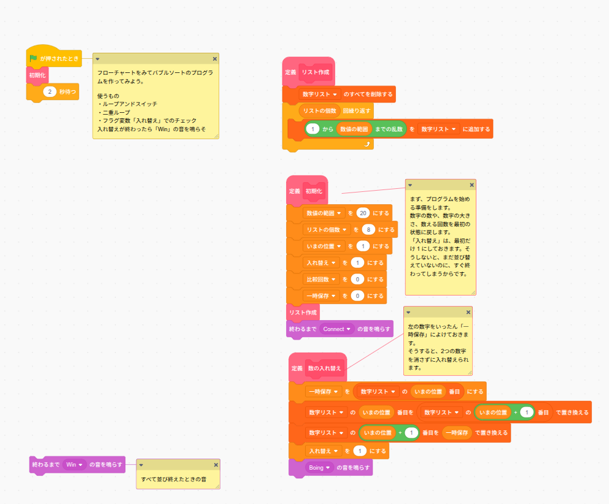
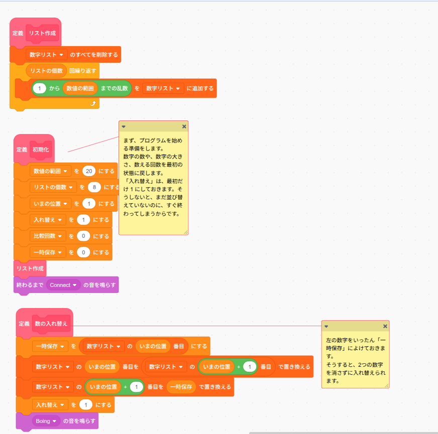
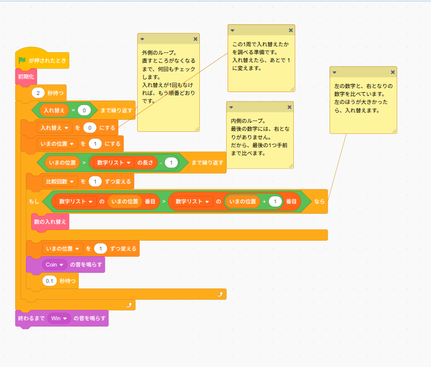

# 講師用テキスト — レッスン12: バブルソート — 隣同士を比べて並び替えよう

## 注意点

- **事前準備**: 「正解プログラム」と「生徒用プログラム」の2つの sb3 を、生徒がダウンロードできる場所に置いておく。
- **生徒用プログラムに入っているもの**: 関数（定義ブロック）3つ — 「リスト作成」「初期化」「数の入れ替え」— と、旗 →「初期化」→「2秒待つ」までのスクリプト、および「終わるまで Win の音を鳴らす」ブロック（未接続）。**生徒が作るのはメインの二重ループ部分だけ**。
- フローチャートは今回が初登場。記号の読み方（ひし形＝質問、四角＝処理）を最初に全体で確認してから制作に入る。
- 「数の入れ替え」関数の中身（一時保存を使う3ステップ）がこのレッスンの概念的な山場。関数として与えてあるので組む必要はないが、**中身の意味は必ず全体で確認**する。
- ステージの「リストの個数」「数値の範囲」はスライダー表示になっているが、**旗を押すと初期化で 8・20 に戻る**。値を変えて実験するときは「初期化」関数の中の数値を書き換えさせる。
- 最後に記録する**比較回数はレッスン13（クイックソート）の速さくらべで使う**。必ずメモを残させる。

## 授業の進め方

### ① フローチャートを提示する

まずフローチャートを配布（または投影）し、読み方を確認する。

- **角丸**: スタート・おわり
- **四角**: 処理（Scratchのブロック1つに対応）
- **ひし形**: 質問。「はい」「いいえ」で進む先が分かれる
- **上に戻る矢印があるひし形**: くりかえし（ループ）。Scratchでは「〜まで繰り返す」ブロックに対応
- 右側の枠は「初期化」「リスト作成」という**関数（定義ブロック）の中身**

読み方を確認したら、ホワイトボードに小さい例（数字4つ程度）を書き、フローチャートの矢印を指でたどりながら**手動でバブルソートを1周**やって見せる。「隣同士を比べて、左が大きければ入れ替え」「1周すると一番大きい数が右端へ＝泡のように浮かぶからバブルソート」を押さえる。

このプログラムで使う考え方も先に言葉にしておく（生徒用プログラムのコメントにも同じことが書いてある）。

- **ループアンドスイッチ**（くりかえしの中の条件分岐）
- **二重ループ**（外側＝周、内側＝1周の中の移動）
- **フラグ変数「入れ替え」でのチェック**（1周まわって入れ替えが0回なら完成 — ループアンドフラグ）

### ② 正解プログラムをダウンロードして動かしてみる

先に完成品を体験させて、ゴールのイメージを持たせる。

- 旗を押すと、最初の2秒でバラバラのリストが見える（観察タイム）
- Coin の音とともに比較が進み、入れ替えのときは Boing の音が鳴る
- 並び終わると Win の音が鳴り、リストが小さい順になっている

「いま見た動きが、さっきのフローチャートのどこ？」と問いかけながら2〜3回実行する。**比較回数**のモニターにも注目させ、「この数字が何を表すか」を考えさせておく（答えは⑦で扱う）。

### ③ 生徒用プログラムをダウンロードして読み込む

生徒用プログラムを開かせ、**すでに入っているもの**を全体で確認する。

| 関数 | 中身 | 確認ポイント |
|---|---|---|
| リスト作成 | リストを空にして、「1から数値の範囲までの乱数」を「リストの個数」回追加 | バラバラのデータを作る係 |
| 初期化 | 数値の範囲=20、リストの個数=8、いまの位置=1、**入れ替え=1**、比較回数=0、一時保存=0 → リスト作成 → Connect音 | なぜ入れ替えだけ1で始めるか（下記） |
| 数の入れ替え | 一時保存 ← いまの位置番目 → いまの位置番目を+1番目で置き換え → +1番目を一時保存で置き換え → 入れ替え=1 → Boing音 | 一時保存の3ステップ |

**「数の入れ替え」は必ず丁寧に扱う。** ジュースのコップの例え（コップAとBを入れ替えるには空のコップがもう1つ必要）で説明する。順番をまちがえると片方の値が消えて同じ数が2つになることを、ホワイトボードで実演するとよい。

**「入れ替え」を1で始める理由**も確認する：フローチャートの最初の質問が「入れ替え = 0？」なので、0で始めるとまだ何もしていないのに「並び替え完了」になってしまう（プログラム内のコメントにも記載あり）。

### ④ フローチャートに従ってプログラムを作る

フローチャートだけを見て、旗スクリプトの続き（メインの二重ループ）を組み立てさせる。**口頭でブロックの並びは教えない**。詰まっている生徒には「フローチャートのどこまでできた？」と、図と照らし合わせる方向で支援する。

フローチャート → Scratch の対応だけ最初に板書しておく。

- 「入れ替え = 0？」＋上に戻る矢印 → **「入れ替え = 0」まで繰り返す**
- 「いまの位置 > 数字リストの長さ - 1？」＋上に戻る矢印 → **「いまの位置 > 数字リストの長さ - 1」まで繰り返す**
- 「数字リストの いまの位置番目 > いまの位置+1番目？」（戻る矢印なし） → **もし〜なら**。中に入れるのは**「数の入れ替え」関数1つ**
- 最後の「終わるまで Win の音を鳴らす」は画面に置いてあるブロックをつなぐだけ

### ⑤ 動かしてチェック

完成したら旗を押して確認させる。チェック観点：

- リストが**小さい順**に並び替わるか
- 並び終わったら **Win の音**が鳴って止まるか
- **比較回数**が増えていくか（0のままなら「比較回数を1ずつ変える」の入れ忘れ）
- 止まらない場合は「入れ替え を 0 にする」の位置を疑う（下記つまずきポイント）

### ⑥ 正解プログラムと比較する

自分のプログラムと正解プログラムを並べて見比べさせる。ブロックの順番が違っても動けば正解であることは伝えつつ、以下は全体で確認する。

- 外側ループの**先頭**で「入れ替え を 0 にする」「いまの位置 を 1 にする」をやり直している理由（周のはじめのリセット）
- 内側ループが「数字リストの長さ - 1」で止まる理由（右端の数字には右どなりがいない）
- 「もし〜なら」の中は「数の入れ替え」関数を呼ぶだけになっていること

### ⑦ まとめ

- バラバラのデータを順番に並べるのが**ソート**。二分探索（レッスン10）はソート済みのデータだから使えた
- バブルソートは「隣同士を比べて、左が大きければ入れ替える」。1周ごとに最大値が右端へ浮かんでいく
- 終わりの判定は**フラグ変数「入れ替え」**：1周で入れ替え0回なら完成
- アルゴリズムの速さは**比較回数**で測る → 各自の比較回数を記録させる（次レッスンでクイックソートと速さくらべ）

## よくあるつまずきポイント

**ひし形を全部「もし〜なら」にしてしまう**

フローチャートのひし形には「ループ（上に戻る矢印つき）」と「分岐（戻らない）」の2種類がある。「矢印が上に戻っていたら『〜まで繰り返す』、戻っていなければ『もし〜なら』」という見分け方を④の板書で示しておく。

**「入れ替え を 0 にする」を外側ループの外に置く**

初期化の直後などに置くと、1周目で入れ替えが起きた時点でフラグが1のまま戻らず、**永遠に止まらない**。フローチャートでは「入れ替え = 0？」の「いいえ」の直後にあること＝**外側ループに入るたびに実行する**ことを確認させる。

**「〜まで繰り返す」の条件の不等号・式をまちがえる**

内側ループを「数字リストの長さ」までにすると、存在しない9番目と比較して最後の比較がおかしくなる。「右端は比べる相手がいない」を画面のリストを指して確認する。

**「数の入れ替え」関数を使わず自分で組もうとする（または呼び忘れる）**

「もし〜なら」の中身は関数1つでよい。関数を呼ぶブロックは「ブロック定義」カテゴリではなく、定義済みブロックとしてパレットに出ていることを見せる。

**スライダーで値を変えたのに元に戻る**

「リストの個数」「数値の範囲」はスライダーで変えられるが、旗を押すと初期化関数が 8・20 に戻す。実験したいときは**初期化関数の中の数値を書き換える**よう伝える。

**同じ数字が並んだときの動きに戸惑う**

数値の範囲が20で8個なので、同じ数（例：20が2つ）がよく出る。比較は「>」なので**同じ数のときは入れ替えない**＝そのまま隣に並ぶ。これは正しい動作。

## 時間配分の目安

| 内容 | 目安 |
|---|---|
| ① フローチャート提示・読み方・手動バブルソート | 10分 |
| ② 正解プログラムを動かしてみる | 5分 |
| ③ 生徒用プログラムの読み込み・関数3つの確認 | 10分 |
| ④ フローチャートに従って制作 | 20分 |
| ⑤ 動かしてチェック | 5分 |
| ⑥ 正解プログラムと比較 | 5分 |
| ⑦ まとめ・比較回数の記録・保存 | 5分 |

④が早く終わった生徒には、初期化関数の「リストの個数 8」を16に変えて比較回数がどう変わるか予想→実験させる（補足説明参照）。

## 補足説明

**なぜ「バブル」ソートか**

1周ごとに、その周での最大値が右端に確定する。大きい値が泡のように浮かび上がる様子から命名。1周目で最大値、2周目で2番目…と右から順に確定していく。

**比較回数の目安**

このプログラムは毎周フルに「リストの個数 - 1」回（8個なら7回）比較するので、**比較回数 = 7 × 周回数**。②のスクリーンショットの35回は「7回 × 5周」。ランダムな8個ならおおむね 21〜56 回になる。教科書的なバブルソートは周ごとに比較範囲を1つずつ狭める（右端は確定済みのため）が、簡単のため毎周フル比較にしている。「比較回数で速さを測る」目的には影響しない。

**リストの個数を2倍にすると比較回数は？**

8個 → 16個にすると、比較回数は2倍ではなく**約4倍**になる（1周の比較回数が約2倍 × 周回数も約2倍）。計算量の入り口として、数式は使わず「2倍じゃなくて4倍!?」という驚きを持たせるだけでよい。レッスン13のクイックソートでこの差が効いてくる。

**フラグ変数「入れ替え」による終了判定（ループアンドフラグ）**

「入れ替えが0回の周＝ソート完了」という判定は、レッスン02のループアンドフラグと同じパターン。すでに並んでいるリストなら1周（7回の比較）で終了する。時間があれば、リスト作成関数の乱数を狭い範囲にして同じ数字だらけにするなど、周回数が変わる様子を見せると面白い。

**ソート学習の位置づけ**

| レッスン | ソート | キーワード |
|---|---|---|
| 12 | バブルソート | 隣同士の比較・入れ替え、比較回数の導入 |
| 13 | クイックソート | 分割統治法、圧倒的に少ない比較回数 |

レッスン12の比較回数の記録がレッスン13の速さくらべの伏線になるため、記録を残すことだけは徹底する。
